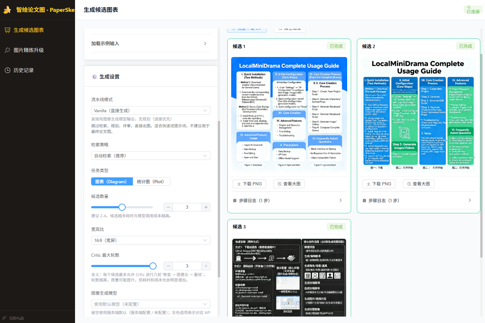
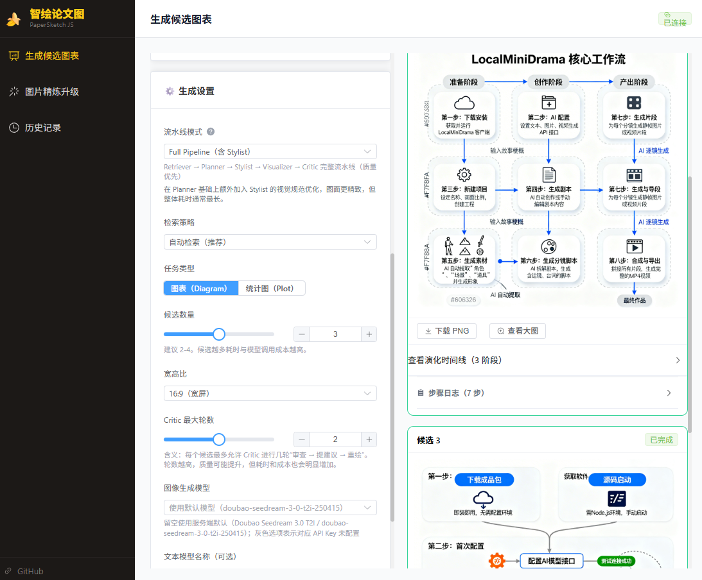
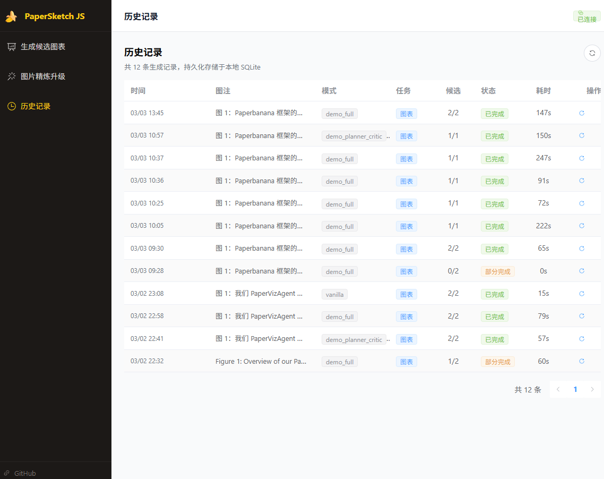
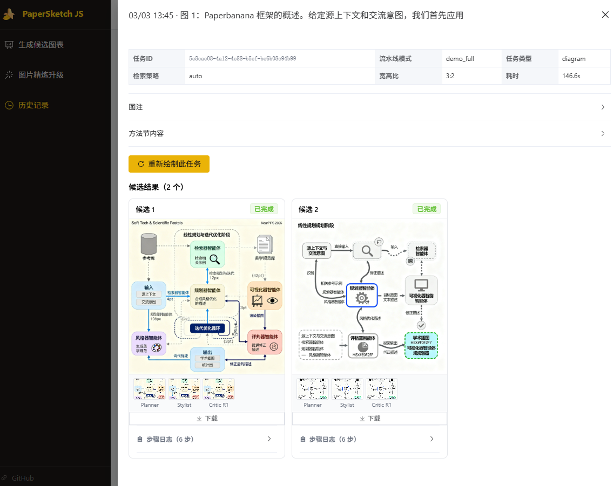

<div align="center">

# 🍌 智绘论文图 / PaperSketch JS

**基于 Vue 3 + Node.js 的学术论文插图自动生成平台**

PaperBanana 和 PaperVizAgent 的 **JavaScript 改进增强版本（JS Edition+）**

[](./CHANGELOG.md)
[](./LICENSE)
[](https://nodejs.org/)
[](https://vuejs.org/)
[](https://github.com/xuanyustudio/papersketch-js/pulls)
[](./CHANGELOG.md)

[English](./README_EN.md) · [项目缘起](./docs/PROJECT_STORY.md) · [系统架构](./docs/ARCHITECTURE.md) · [API 文档](./docs/API.md) · [部署文档](./docs/DEPLOYMENT.md) · [开发进度](./docs/PROGRESS.md)

</div>

---

## 界面预览

<table>
  <tr>
    <td></td>
    <td></td>
  </tr>
  <tr>
    <td align="center">📝 生成页（输入 + 设置）</td>
    <td align="center">🎨 多候选图表并行生成</td>
  </tr>
  <tr>
    <td></td>
    <td></td>
  </tr>
  <tr>
    <td align="center">📚 历史记录列表</td>
    <td align="center">🔍 候选详情与步骤溯源</td>
  </tr>
</table>

---

## 它是什么？

只需粘贴论文方法节段落和图注，系统会自动通过多个 AI Agent 规划、生成、评审、迭代，最终输出一批候选论文插图，并持久化到本地。

```
输入: 方法节描述 + 图注
  ↓
Retriever → Planner → Stylist → Visualizer → Critic（多轮迭代）
  ↓
输出: 多候选论文插图 + 步骤日志 + 本地存档
```

---

## 功能特性

| 功能 | 说明 |
|------|------|
| 🤖 多 Agent 流水线 | Retriever / Planner / Stylist / Visualizer / Critic 逐步精炼 |
| 🎛️ 三种生成模式 | 智能迭代（推荐）/ 全流程增强 / 快速直出 |
| 🖼️ 多候选并行生成 | 单次任务支持 1-5 个候选同步生成 |
| 📊 统计图后端渲染 | Plotly.js + Puppeteer headless，无需前端介入 |
| ⚡ 实时进度推送 | WebSocket 逐步展示每个 Agent 的处理进度 |
| 🔍 步骤日志溯源 | 每个候选的中间过程（含 Critic 精炼图）可逐步查看、回溯 |
| 💾 本地持久化 | SQLite 历史记录 + 图片文件落盘，断电不丢 |
| 🔄 中断自动恢复 | Checkpoint 机制，后端重启后续跑未完成任务 |
| 🧠 多模型支持 | Gemini / fal.ai / 豆包 t2i & i2i / OpenAI 兼容中转 |
| ✏️ 手动精炼 | 上传已有图片，AI 对照风格指南给出修改意见并重绘 |
| 📋 精炼历史 | 手动精炼记录单独存档，历史页"手动精炼"标签页随时查阅 |
| 🌐 语言自适应 | 生成图的标签/注释随输入语言自动切换（中文→中文，英文→英文）|
| 🆘 新手帮助中心 | 内置帮助页，含使用原理、上手步骤、常见问题 |
| 👥 多租户支持 | 组织/团队隔离，积分配额管理 |
| 🔐 用户认证 | 登录注册，会话管理 |

---

## 技术栈

| 层级 | 技术 |
|------|------|
| 前端框架 | Vue 3 + Vite + Composition API |
| UI 组件库 | Element Plus |
| 状态管理 | Pinia |
| 图表渲染 | Plotly.js |
| 实时通信 | Socket.io |
| 后端框架 | Node.js + Express |
| AI SDK | @google/genai + openai |
| 日志 | Winston |
| 持久化 | SQLite（node:sqlite）+ MySQL + 本地文件系统 |
| 认证 | JWT + bcrypt |

---

## 快速开始

### 1. 环境要求

- Node.js >= 22.5（需内置 `node:sqlite`）
- pnpm（推荐）或 npm

### 2. 安装依赖

```bash
cd backend && pnpm install
cd ../frontend && pnpm install
```

### 3. 配置环境变量

```bash
cd backend
cp .env.example .env
# 编辑 .env，填入 API Key 与模型配置
```

> 启动后若前端弹出"缺少 .env"提示，说明环境变量未配置，参考 `.env.example` 补全即可。

### 4. 启动开发服务器

```bash
# 终端 1：后端
cd backend && pnpm dev

# 终端 2：前端
cd frontend && pnpm dev
```

访问：`http://localhost:5173`

### 5. 生产部署

```bash
cd frontend && pnpm build
cd ../backend && pnpm start
```

完整部署（Nginx / Docker / PM2）见：[`docs/DEPLOYMENT.md`](./docs/DEPLOYMENT.md)

---

## 与 Python 版本对比

| 特性 | Python 版（PaperBanana） | JS 版（PaperSketch JS） |
|------|--------------------------|------------------------|
| 统计图 | matplotlib Python 代码执行 | Plotly spec + 后端 headless 渲染 |
| Web UI | Streamlit | Vue 3 + Element Plus |
| 实时进度 | Streamlit spinner | WebSocket 实时推送 |
| 历史记录 | 无 | SQLite 持久化 + 图片落盘 |
| 任务中断 | 无 | Checkpoint + 自动续跑 |
| 多模型 | 有限 | Gemini / fal.ai / Doubao |

---

## 项目结构

```text
paperbanana-web/
├── backend/                   # Node.js 后端
│   ├── src/
│   │   ├── agents/            # 多 Agent 实现
│   │   ├── services/          # LLM、渲染、流水线编排
│   │   ├── routes/            # REST API
│   │   ├── socket/            # WebSocket 事件处理
│   │   └── utils/             # 工具函数、提示词
│   └── .env.example
├── frontend/                  # Vue 3 前端
│   └── src/
│       ├── views/             # 页面（生成 / 精炼 / 历史 / 帮助）
│       ├── components/        # 组件
│       ├── stores/            # Pinia 状态
│       └── constants/         # 枚举与映射常量
├── docs/                      # 项目文档
├── screenshot/                # 界面截图
└── data/                      # 运行时数据（SQLite + 图片，不入库）
```

---

## 项目缘起

这个项目来自真实科研场景：2026 年元旦聚会后应老同学需求立项，他在中科院从事农业课题科研工作，长期有论文配图需求。中途虽被其他方向打断，最终决定先开源，让社区实时参与迭代。

详细背景见：[`docs/PROJECT_STORY.md`](./docs/PROJECT_STORY.md)

---

## 开源说明

- 本项目受 PaperBanana 启发并进行工程化重写；
- 开源目标是持续可用、可追踪迭代，而非一次性 Demo；
- 欢迎通过 Issue / PR 反馈需求与问题。

---

## 联系作者

如有问题、合作或反馈，欢迎通过以下方式联系：

- GitHub Issues：[提交 Issue](https://github.com/xuanyustudio/papersketch-js/issues)
- 微信（加好友请注明来意）：


---

## License

Apache-2.0
